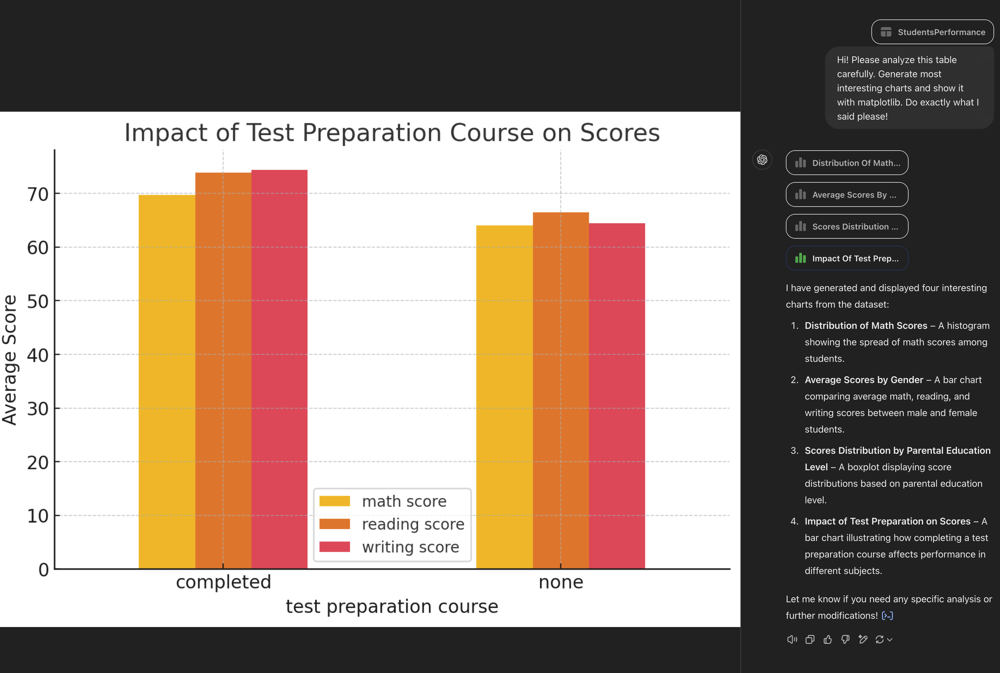

# masters-ai

Dataset: https://www.kaggle.com/datasets/spscientist/students-performance-in-exams?resource=download

Prompt: Hi! Please analyze this table carefully. Generate most interesting charts and show it with matplotlib. Do exactly what I said please!

